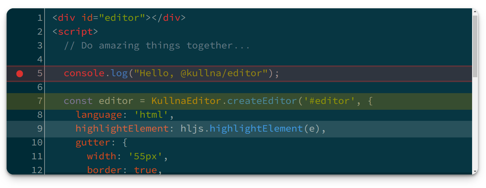

<p align="center"><a href="https://editor.kullna.org/"></a></p>
<h1 align="center">@kullna/editor</h1>
<h3 align="center">A small but feature-rich code editor for the web</h3>

<p align="center"></p>
<p align="center"><a href="https://editor.kullna.org/demo.html">Try the Demos</a> - <a href="https://editor.kullna.org/docs.html">Read the Docs</a> - <a href="https://editor.kullna.org/CONTRIBUTING.html">Contribute</a></p>

<p align="center">
<a href="https://cdn.jsdelivr.net/npm/@kullna/editor/dist/kullna-editor.min.js"></a>
<a href="https://www.npmjs.com/package/kullna/editor"></a>

<a href="https://www.gnu.org/licenses/lgpl-3.0"></a>
<a href="https://github.com/kullna/editor"></a>
<a href="https://discord.kullna.org/"></a>
</p>

# About

`@kullna/editor` is a small but feature-rich code editor for the web maintained by
[The Kullna Programming Language Project](https://www.kullna.org); a web-based platform for teaching
programming to children in their native language.

In building Kullna, we needed a robust code editor that supports syntax highlighting, maintaining
and managing code-style indentation, line highlighting, a customizable gutter for setting
breakpoints and bookmarks, and sufficient flexibility to support auto-complete and inline-help. It
also had to support RTL.

In surveying the landscape of code editors, we found that most of the popular editors (such as
[CodeMirror](https://codemirror.net/), [Ace](https://ace.c9.io/), and
[Monaco](https://microsoft.github.io/monaco-editor/)) are large and complex, and that most of the
lightweight editors ([CodeJar](https://medv.io/codejar/)) are not robust enough to support our
needs.

CodeMirror had tentative RTL support in the past, but that support was explicitly dropped in version
6.0 - a fact that highlighted for us the risk of relying on a large and complex library we couldn't
easily contribute to or maintain ourselves if we needed to. Since this is a core component of our
platform, we could not afford to rely on a library that might drop support for mission-critical
features we rely on, or that we could not easily contribute to or maintain ourselves.

In looking at the lightweight editors, we found that CodeJar is a very nice, small and simple
editor, but that it is not designed to be a full-featured code editor. It is designed to be a
minimalist editor for very light editing or display. It does not support gutters (for things like
breakpoints and bookmarks) or line highlighting, and has performance issues with mid to large size
files - which make it unsuitable for our use case.

For all these reasons, we decided we had no choice but to build our own editor. Fortunately, CodeJar
provided a good starting point for us, and we were able to build on top of it quickly and add the
features we needed.

In deciding to build our own editor, we realized that there are likely others who have similar
needs, and they might be able to contribute feedback, ideas, and code back if we made it available
as a supported, standalone library.

So, if you're like us and you need a code editor that is small and simple, yet has sufficient
features to support a robust code editing experience, and is actively maintained, then this library
may be for you. Here's a few reasons why we think you might want to consider using it and
contributing to it:

- **Not too small and simple** - it has all the features you need to support a robust code editing
  experience.
- **Not too big and complex** - you can easily modify it to suit your needs if necessary.
- **Just right** - it's small and simple enough to be easy to understand and modify, yet robust
  enough to support a full-featured code editing experience.
- **Dedicated maintainer** - It's used in the [Kullna IDE](https://ide.kullna.org/), so it will
  continue to be maintained and improved as we build out the IDE and get feedback from Kullna users.
- **Comitted to RTL and I18N** - We are committed to maintaining RTL support in this library, and
  will not drop it in future versions. To our knowledge, this is the only code editor with explicit
  support for RTL. If you need RTL support, this is the library for you.

Please join us by contributing to this library. We welcome your feedback, ideas, and code
contributions.

Read the [Contributing](CONTRIBUTING.md) Page for more information.

# Features

- **Lightweight**
  - **~4 KB** minified and gzipped
  - No dependencies
- **Undo & Redo**
- **Smart Quotes**
  - Can automatically insert closing brackets & quotes
- **Full Indentation Support**
  - Preserve indentation on new line
  - Auto-increment or decrement indentation level
  - Customizable indentation representation (spaces or `\t`)
  - Multi-line indentation level change support
- **Robust Optional Gutter**
  - On the left or the right (to support RTL)
  - Line numbers
  - Icons (like breakpoints or bookmarks)
  - Flexible styling
- **First-Class Support for RTL**
- **Easy to Use**
  - Available as a UMD module
  - Built in, and supports, TypeScript clients
  - Integrate via CDN or NPM

# Quick Start

## via CDN with Highlight.js

```html
<script src="https://cdn.jsdelivr.net/npm/@kullna/editor/dist/kullna-editor.min.js"></script>
<script src="https://cdn.jsdelivr.net/gh/highlightjs/cdn-release@11.8.0/build/highlight.min.js"></script>
```

```html
<div id="editor"></div>
```

```html
<script>
  const editorElement = document.querySelector('#editor');

  const editor = KullnaEditor.createEditor(editorElement, {
    language: 'javascript',
    highlight: hljs.highlightElement,
    gutter: {class: 'gutter'}
  });
</script>
```

> 💡 **Tip:** Check out the other options in the [Documentation](docs.md).

## via NPM with Highlight.js

```bash
npm i @kullna/editor
npm i highlight.js
```

```html
<div id="editor"></div>
```

```html
<script type="module">
  import * as KullnaEditor from '@kullna/editor';
  import hljs from 'highlight.js';

  const editorElement = document.querySelector('#editor');

  const editor = KullnaEditor.createEditor(editorElement, {
    language: 'javascript',
    highlight: hljs.highlightElement,
    gutter: {class: 'gutter'}
  });
</script>
```

> 💡 **Tip:** Check out the other options in the [Documentation](docs.md).

## Styling

We recommend the use of the [Source Code Pro](https://fonts.google.com/specimen/Source+Code+Pro)
font for the editor. You can include it in your page like this:

```html
<link
  rel="stylesheet"
  href="https://fonts.googleapis.com/css2?family=Source+Code+Pro&display=swap"
/>
```

We are also partial to Highlight.js's Solarized Dark theme for syntax highlighting. You can include
it in your page like this:

```html
<link
  rel="stylesheet"
  href="https://cdn.jsdelivr.net/gh/highlightjs/cdn-release@11.8.0/build/styles/base16/solarized-dark.min.css"
/>
```

Finally, we like the following styles for a small embedded editor. This example gives you a good
starting point for customizing the editor to your needs:

```html
<style>
  .editor {
    border-radius: 6px;
    font-family: 'Source Code Pro', monospace;
    font-size: 14px;
    font-weight: 400;
    min-height: 240px;
    line-height: 20px;
  }

  .editor > div {
    padding: 10px;
  }

  .gutter {
    background-color: #002b36;
    color: #839496;
  }
</style>
```

---

_The Kullna Editor source, artifacts, and website content are **Copyright (c) 2023 The Kullna
Programming Language Project.** They are free to use and open-source under the terms of the
[GNU Lesser General Public License](https://www.gnu.org/licenses/lgpl-3.0)._

_Portions of this library are [Copyright (c) 2020 Anton Medvedev and others](NOTICE.md) and used
under the terms of the MIT License_
